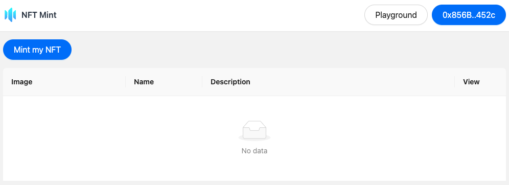
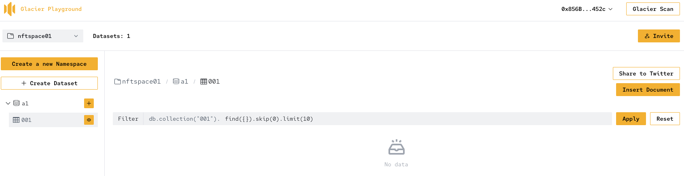
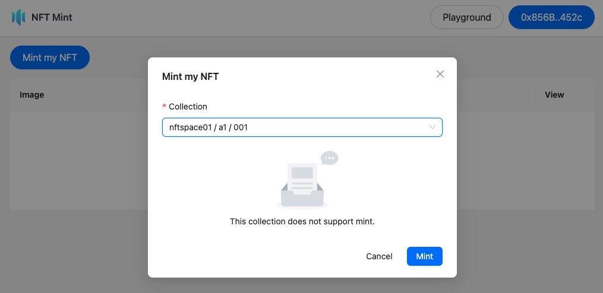
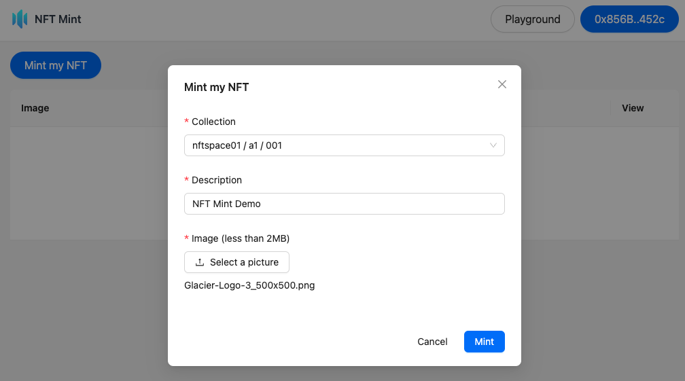
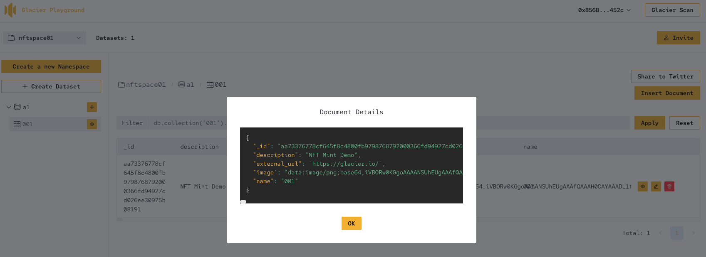
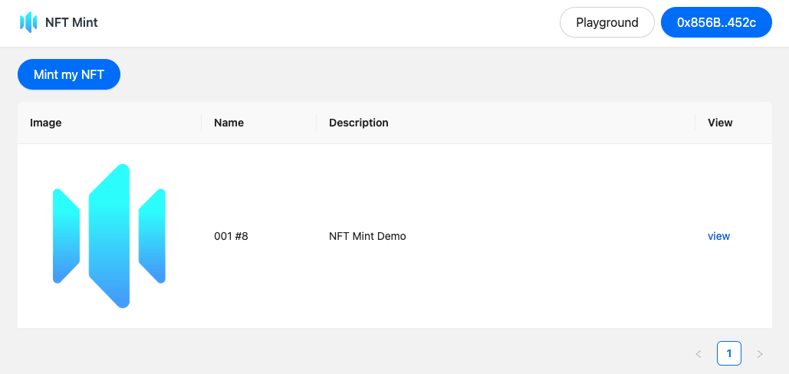

# An NFT Demo

- NFT1155
- NFTGateway
- NFTMint
- NFTUi

More details: [https://sdk.glacier.io/tutorial/demo_nft/](https://sdk.glacier.io/tutorial/demo_nft/)

## Demo Guide

You can quickly explore the online demo [here](https://nftmint.devspace.cc/)

1. Obtain test $BNB : https://www.bnbchain.org/en/testnet-faucet

2. Bridge $BNB to opbnb testnet: https://opbnb-testnet-bridge.bnbchain.org/deposit

3. Create an empty collection on glacier playground: https://playground.bnb.glacier.io/

4. Waiting for glacierscan to index your collection: https://scan.bnb.glacier.io/ (It may take a few minutes, up to 15 minutes)

5. Once glacierscan has indexed, you can mint an NFT for your collection

6. The NFT metadata is stored in your collection, including your NFT Image!

7. NFT Minted!

